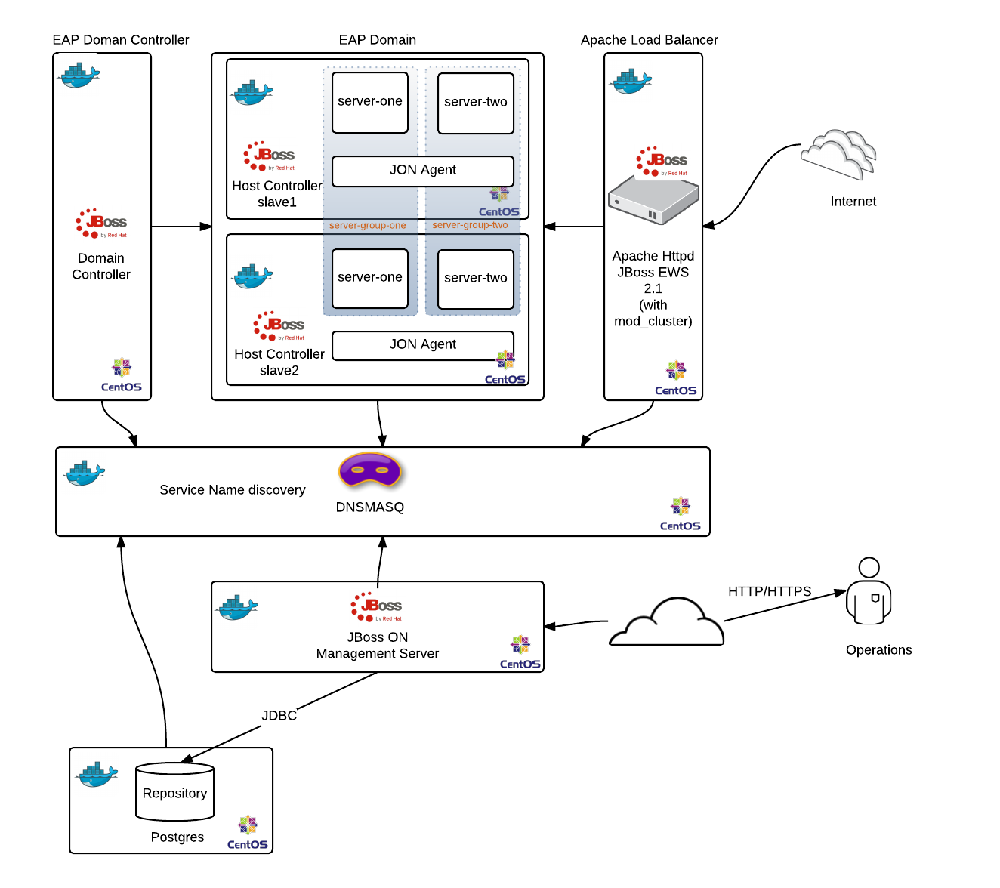
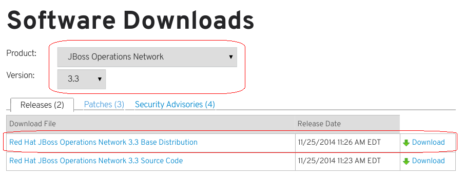
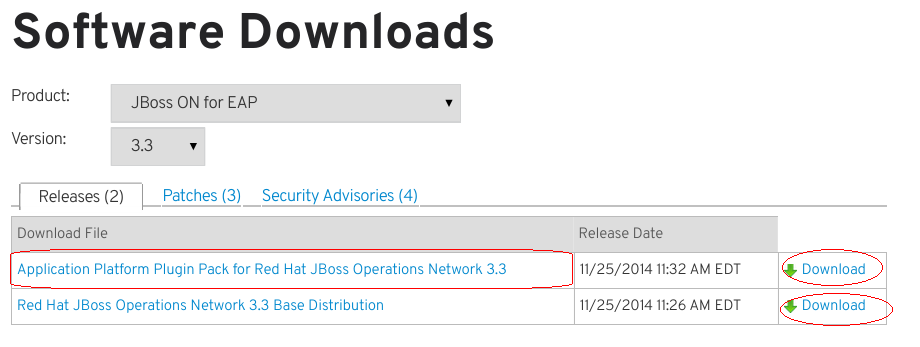
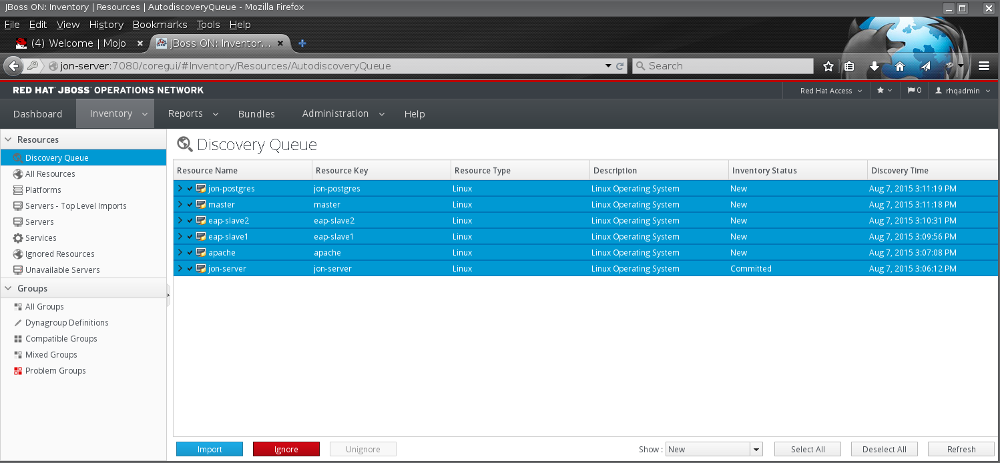
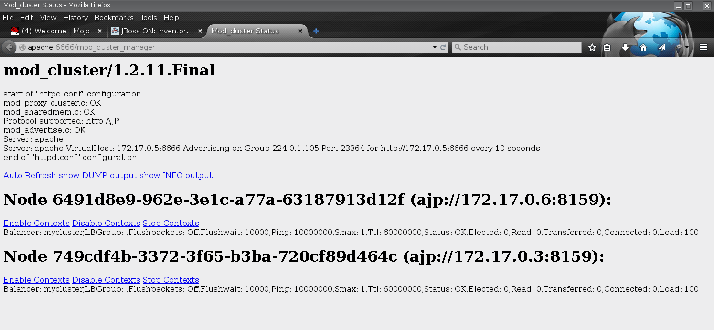

# JBoss EAP Managed on Docker

## Intruduction
Provides a complete **JBoss EAP 6** environment managed by **JBoss Operations Network** (JON/RHQ) and load balanced/proxied by **Apache Httpd Server** (JBoss EWS with `mod_cluster`)

The diagram below shows the complete environment.


**Wait!** With `docker` and `docker-compose` you can setup all this environment in your Laptop/Workstation **_in a few minutes and in an automated way_**. Yeah, thats the magic of Containers.

This setup gives you a whole JBoss EAP "infrastructure playground" to test, demo, workshop whatever you need to do with JBoss EAP. You have:

* **Apache Httpd Server** (JBoss EWS)
 * front-end for proxy/load balancer functions
* **JBoss EAP** (Domain Mode)
 * with two nodes (Host Slaves)
 * and two server groups
* **JBoss Operation Network** (JON)
 * to manage and monitor all the environment

So, you can do many things:
* deploy your JavaEE applications
* provision new server groups
 * provision new server instances
   * with mod_cluster you can see they automatically appear on `mod_cluster_manager` console!
* test clustering and fail over capabilities using the JBoss `full-ha` profile
* show and take advantage of `mod_cluster` capabilities
 * automatic backend node discovery
 * automatic web context mapping (during deploy/undeploy apps in a JBoss node)
 * rich and intelligent load balancing strategies
* monitor and manage all the components present in the setup:
 * app deployment
 * resource configuration
   * JBoss EAP Host Controllers
   * Apache virtual hosts
   * Postgres DB
 * resource provisioning (Bundles)
 * Alert and notification
 * Events
   * resource availability
   * server logs

and many other things JBoss EAP can offer...

---

## Download softwares

Well lets prepare your host to build and setup all these things.

First you have to to download or clone this repository into a work directory in your host.
 * if you have `git` installed in your system:

```git clone git@github.com:rafaeltuelho/jboss-eap-managed-on-docker.git```

 * or just download the repo's zip file: Click on `Download ZIP` button located in right side of this page.

After that you need the product's binaries packages!

Access the https://access.redhat.com with your Red Hat account and download the following zip installers:

> NOTE: download the latest releases!

See some screenshots where you can find each software package on Red Hat Customer Portal.


--

--

--

--

--


At the time I was writing this guide the following versions was available:
```
jboss-eap-6.4.0.zip
jon-server-3.3.0.GA.zip
jon-server-3.3-update-03.zip
jboss-ews-httpd-2.1.0-RHEL7-x86_64.zip
jon-plugin-pack-eap-3.3.0.GA.zip
jboss-eap-6.4.2-patch.zip
jboss-eap-native-webserver-connectors-6.4.0-RHEL7-x86_64.zip
```

put them all inside the `software/` directory.

## Prepare the environment

Now execute the `./prepare.sh` script.

It will check some prereqs in your system and build all the Docker Images needed by `docker-compose` to startup the Containers.

> NOTE: the build step takes some time to finish. Be patient and wait...

> During the build process the scripts will apply any existing update/patch (if exists) to the products installation.

when the prepare step is finished you can verify the docker images in your local repository. Some thing like that:

```
> docker images
REPOSITORY             TAG                 IMAGE ID            CREATED             VIRTUAL SIZE
rsoares/eap            latest              bcdd3e032a7e        About an hour ago   1.53 GB
rsoares/jon-server     latest              e084c057a6cc        3 days ago          2.125 GB
rsoares/ews            latest              c3fe3359bbea        3 days ago          547.1 MB
rsoares/jon-postgres   latest              0061bd278821        3 days ago          566 MB
rsoares/jon-agent      latest              62f750308407        3 days ago          497.2 MB
rsoares/java-base      latest              f0b4b37fbc5a        3 days ago          459.4 MB
rsoares/centos7-base   latest              a60bfe564a73        3 days ago          234.5 MB
rsoares/dnsmasq        latest              5e19b0dd6eb0        3 days ago          189 MB
centos                 centos7             7322fbe74aa5        7 weeks ago         172.2 MB
centos                 latest              7322fbe74aa5        7 weeks ago         172.2 MB
centos/postgresql      latest              abd6fe69720d        9 months ago        327.3 MB
```

== Startup!

after that, if all worked fine you finally can do

```
docker-compose up
```
you should see a lot of output in your console. Docker Compose start the containers in foreground (if you don't specify `-d` option).

```
> docker-compose up
Creating jbosseapmanagedondocker_dnsmasq_1...
Creating jbosseapmanagedondocker_eapmaster_1...
Creating jbosseapmanagedondocker_eapslave1_1...
Creating jbosseapmanagedondocker_jonpostgres_1...
Creating jbosseapmanagedondocker_ewshttpd_1...
Creating jbosseapmanagedondocker_eapslave2_1...
Creating jbosseapmanagedondocker_jonserver_1...
Attaching to jbosseapmanagedondocker_dnsmasq_1, jbosseapmanagedondocker_eapmaster_1, jbosseapmanagedondocker_eapslave1_1, jbosseapmanagedondocker_jonpostgres_1, jbosseapmanagedondocker_ewshttpd_1, jbosseapmanagedondocker_eapslave2_1, jbosseapmanagedondocker_jonserver_1

...

```
> it may take few minutes to `docker-compose` create all the containers. Remember the infra diagram! There are many components involved in this setup.

> NOTE: in RHEL like systems (Fedora or Centos) the Local Firewall runs by default. If this is your case, stop it or add a new rule to accept connections on `docker0` interface for UDP PORT `53` (DNS). Our `dnsmasq` service binds to `docker0` (usually with `172.17.42.1` addr).

## Access the services

To be able to access the services by name on your local browser add a new entry in your `/etc/resolv.conf` file (Docker Host).

```
sudo vim /etc/resolv.conf
nameserver 172.17.42.1
```

Now you can access the services by name:
* JON Server console: `http://jon-server:7070/`
 * login credentials: `rhqadmin/rhqadmin`


> NOTE: you have to manually import the discovered resource in the first time JON start monitor a given host. Select all the resource in the `Inventory > Discovery Queue` and click the Blue `Import` button.

* JBoss EAP Management Console (Doman COntroller): `http://master:9990/`
 * login credentials: `admin/jboss@123`


* Apache Httpd mod_cluster Manager: `http://apache:6666/mod_cluster_manager`

* Web App through Apache front-end: `http://apache/<webapp context root>`

> NOTE: By default Google Chrome will note open URL with ports above 1024. Use the Firefox in this case.

To access some container shell use the `docker exec` command.

Get the container's name or id you want to access.
```
> docker-compose ps
                Name                                 Command                                 State                                  Ports
---------------------------------------------------------------------------------------------------------------------------------------------------------
jbosseapmanagedondocker_dnsmasq_1      /run.sh                                Up                                     53/tcp, 172.17.42.1:53->53/udp
jbosseapmanagedondocker_eapmaster_1    /run.sh domain --host-conf ...         Up                                     23364/tcp, 4447/tcp, 45688/tcp,
                                                                                                                     45700/tcp, 54200/tcp, 5455/tcp,
                                                                                                                     55200/tcp, 7500/tcp, 8080/tcp,
                                                                                                                     9990/tcp, 9999/tcp
jbosseapmanagedondocker_eapslave1_1    /run.sh domain --host-conf ...         Up                                     23364/tcp, 4447/tcp, 45688/tcp,
                                                                                                                     45700/tcp, 54200/tcp, 5455/tcp,
                                                                                                                     55200/tcp, 7500/tcp, 8080/tcp,
                                                                                                                     9990/tcp, 9999/tcp
jbosseapmanagedondocker_eapslave2_1    /run.sh domain --host-conf ...         Up                                     23364/tcp, 4447/tcp, 45688/tcp,
                                                                                                                     45700/tcp, 54200/tcp, 5455/tcp,
                                                                                                                     55200/tcp, 7500/tcp, 8080/tcp,
                                                                                                                     9990/tcp, 9999/tcp
jbosseapmanagedondocker_ewshttpd_1     /run.sh                                Up                                     6666/tcp, 80/tcp
jbosseapmanagedondocker_jonpostgres_   /run.sh                                Up                                     16163/tcp, 5432/tcp
1
jbosseapmanagedondocker_jonserver_1    /run.sh                                Up                                     7080/tcp

```

with the container's name or id:
```
docker exec -ti jbosseapmanagedondocker_eapmaster_1 /bin/bash
```

## Other tasks

### To stop all the environment use:
```
docker-compose stop
```

### To cleanup the stopped images to save you disk space:
```
docker rm `sudo docker ps -qa --filter 'status=exited'`
```

### To see how many resources (CPU and RAM) your containers are consuming:

```
docker stats \
  jbosseapmanagedondocker_dnsmasq_1 \
  jbosseapmanagedondocker_jonpostgres_1 \
  jbosseapmanagedondocker_jonpostgres_1 \
  jbosseapmanagedondocker_ewshttpd_1 \
  jbosseapmanagedondocker_eapmaster_1 \
  jbosseapmanagedondocker_eapslave1_1 \
  jbosseapmanagedondocker_eapslave2_1

```

You should see something like that:
```
CONTAINER                               CPU %               MEM USAGE/LIMIT     MEM %               NET I/O
jbosseapmanagedondocker_dnsmasq_1       0.00%               1.262 MB/12.11 GB   0.01%               1.046 MB/69.34 kB
jbosseapmanagedondocker_eapmaster_1     0.21%               448.4 MB/12.11 GB   3.70%               58.44 MB/44.36 MB
jbosseapmanagedondocker_eapslave1_1     0.87%               1.324 GB/12.11 GB   10.93%              57.46 MB/44.82 MB
jbosseapmanagedondocker_eapslave2_1     0.66%               1.271 GB/12.11 GB   10.50%              58.52 MB/43.84 MB
jbosseapmanagedondocker_ewshttpd_1      0.09%               186.6 MB/12.11 GB   1.54%               37.85 MB/22.32 MB
jbosseapmanagedondocker_jonpostgres_1   0.17%               320.5 MB/12.11 GB   2.65%               100.4 MB/211 MB
jbosseapmanagedondocker_jonpostgres_1   0.17%               320.5 MB/12.11 GB   2.65%               100.4 MB/211 MB
```
